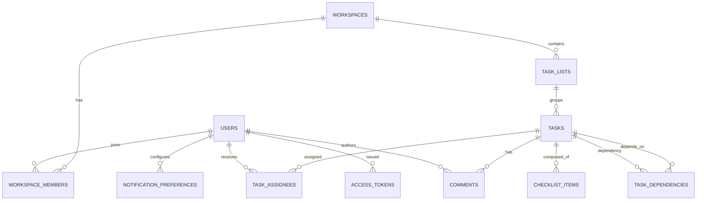

# データモデルとイベントスキーマ / Data Model & Event Schema

## リレーショナルモデル / Relational Model



### 主なテーブル / Key Tables
- **WORKSPACES**: `id`, `name`, `billing_plan`, `default_locale`, `created_at`。
- **WORKSPACE_MEMBERS**: `workspace_id`, `user_id`, `role`, `invited_by`, `joined_at`。
- **TASKS**: `id`, `task_list_id`, `title`, `description`, `status`, `priority`, `due_at`, `start_at`, `estimate_point`, `updated_at`。
- **COMMENTS**: `id`, `task_id`, `author_id`, `body`, `mentions`, `attachments`, `created_at`, `moderation_state`。
- **ACCESS_TOKENS**: `id`, `user_id`, `type`(PAT/Guest/Service), `expires_at`, `revoked_at`。
- **AUDIT_LOGS**: `id`, `event_type`, `actor_id`, `target_id`, `payload`, `recorded_at`, `ip_address`。

## 認証関連データ / Authentication Data
- **IDENTITIES**: 外部IDプロバイダーとのリンク（OIDC sub、SAML NameID）。
- **MFA_FACTORS**: TOTP、WebAuthn、SMSなどの多要素デバイス。
- **SESSION_TOKENS**: 短期セッション。デバイス情報とリフレッシュトークンを管理。
- **INVITE_TOKENS**: メールベースのゲスト招待。使い捨てで24時間有効。

## イベントスキーマ / Event Schema

```json
{
  "eventId": "uuid",
  "eventType": "task.status.changed",
  "occurredAt": "2024-05-01T12:34:56Z",
  "actor": {
    "userId": "usr_123",
    "workspaceId": "ws_456",
    "roles": ["Member"]
  },
  "entity": {
    "taskId": "task_789",
    "previousStatus": "Todo",
    "currentStatus": "InProgress"
  },
  "context": {
    "source": "web",
    "ip": "203.0.113.10",
    "correlationId": "req_a1b2c3"
  }
}
```

- イベントはKafkaトピック`task-events`へパブリッシュされ、NotificationとAnalytics両方で購読。
- 監査用イベントはWORM（Write Once Read Many）ストレージにアーカイブし、15か月保持。

## インデックスとパフォーマンス / Indexing & Performance
- `TASKS(due_at, status)`に複合インデックスを作成し、期限超過の検索を高速化。
- `COMMENTS(task_id, created_at)`で時間順表示を最適化。
- `AUDIT_LOGS(actor_id, recorded_at)`で調査時のフィルタリングを改善。
- JSONBフィールド（`payload`, `mentions`）には部分インデックスを利用し、全文検索はElasticsearchに委譲。

## データライフサイクル / Data Lifecycle
- アーカイブポリシー: 完了から180日経過したタスクは低頻度アクセスストレージへ移行。
- 削除ポリシー: ゲストセッションやOTPコードは使用後5分で削除。監査ログは保持期間終了後に暗号化廃棄。
- バックアップ: 毎時のスナップショットと、Point-in-Time Recovery (PITR)を有効化。
