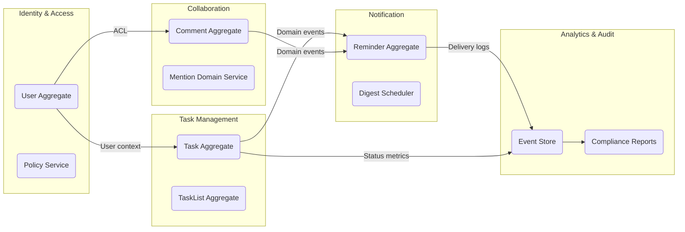

# ドメイン駆動設計 / Domain-Driven Design Overview

## 境界づけられたコンテキスト / Bounded Contexts

| コンテキスト | 説明 | 主な責務 | チーム |
| --- | --- | --- | --- |
| Task Management | タスク・リスト・依存関係の管理。 | タスクCRUD、ステータス遷移ルール、サブタスク。 | Core Productivity |
| Collaboration | コメント、メンション、リアクション。 | 実時間同期、モデレーション、履歴。 | Collaboration |
| Notification | リマインダー、バッチ通知、集約。 | 配送チャネル管理、サイレント時間設定。 | Messaging |
| Identity & Access | 認証・認可・ゲストアクセス。 | OIDC連携、RBACポリシー、SCIMプロビジョニング。 | Platform |
| Analytics & Audit | 指標、監査証跡、レポート。 | イベント集計、異常検知、コンプライアンスレポート。 | Insights |

## ユビキタス言語 / Ubiquitous Language
- **Workspace**: チームやプロジェクトの論理的な容器。課金単位でもある。
- **Task List**: 特定のテーマでグループ化されたタスク集合。WIP制限を設定可能。
- **Checklist**: タスク内のステップを追跡する軽量コンポーネント。状態は`Open/Done/Blocked`。
- **Reminder Policy**: 通知スケジュールとチャネルの組合せを定義するポリシー。サイレント時間帯を含む。
- **Guest Session**: 限定公開リンク経由のアクセスコンテキスト。時間制限と操作制限がある。
- **Activity Event**: 監査と分析の両方で利用される標準化イベント。JSON Schemaで定義。

## アグリゲートと不変条件 / Aggregates & Invariants
- **Task Aggregate**
  - 不変条件: 期限は開始日より後、担当者はWorkspaceメンバーに限定。
  - 操作: 状態遷移、優先度変更、チェックリスト操作。
- **Comment Aggregate**
  - 不変条件: 作成者は対象タスクの閲覧権限が必要。MentionsはWorkspaceメンバーに限定。
  - 操作: コメント投稿、編集、スレッド化、モデレーションキュー。
- **Reminder Aggregate**
  - 不変条件: 同一チャネル・ユーザー組み合わせでは同時刻に1件まで。
  - 操作: スヌーズ、バッチング、緊急通知（override）。
- **Policy Service**
  - 不変条件: ゲストポリシーには有効期限と使用回数制限が必須。
  - 操作: SCIM経由のプロビジョニング、グループベース権限更新。

## コンテキストマップ / Context Map

| 関係 | From | To | 契約 | 説明 |
| --- | --- | --- | --- | --- |
| Customer/Supplier | Collaboration | Identity & Access | GraphQL Federation | コメント作成時にユーザー権限の照会が必要。 |
| Conformist | Notification | Task Management | Domain Events (Kafka) | 状態遷移イベントに合わせて通知を生成。 |
| Anti-Corruption Layer | Analytics & Audit | External BI | gRPC Adapter | 監査ログを外部BIへ変換する際のフォーマット変換。 |
| Shared Kernel | Task Management & Collaboration | JSON Schema | `ActivityEvent`のスキーマを共有し、整合性を保つ。 |

## 実装への示唆 / Implementation Guidance
- 各コンテキストは独立したリポジトリで管理し、契約テストでドメインイベントの互換性を担保。
- ユーザー属性や権限はIdentity & Accessコンテキストが唯一の情報源（SSOT）。
- DDD観点の観測ポイントをCIで自動生成し、RAG検索で関連する仕様を迅速に参照できるようにする。
