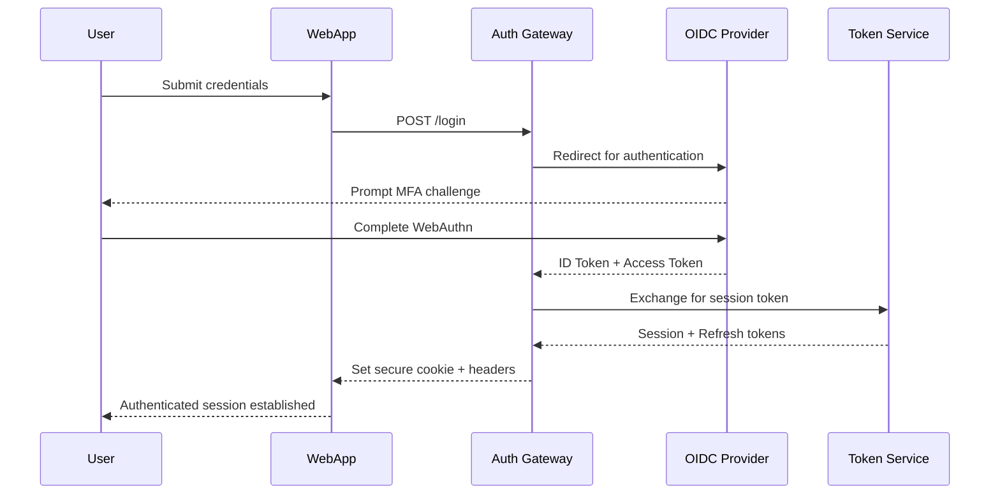
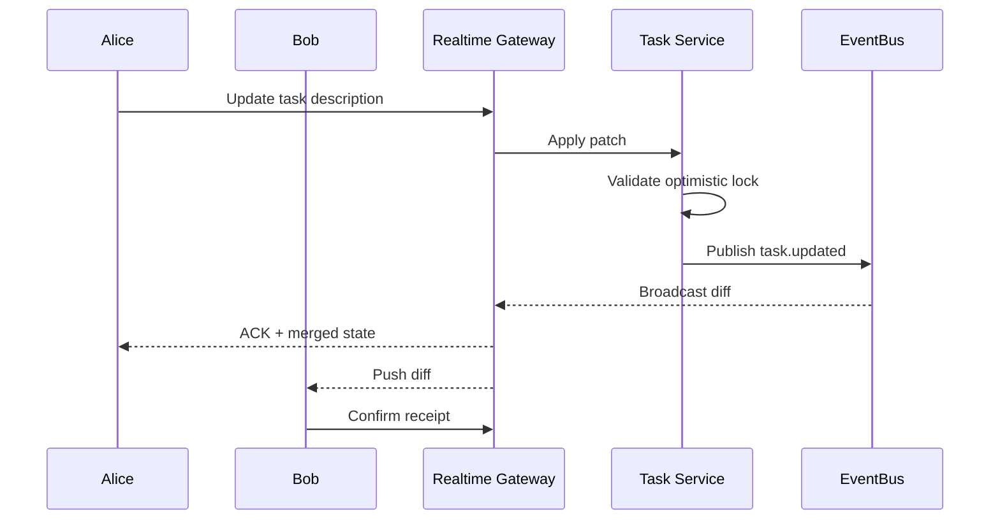
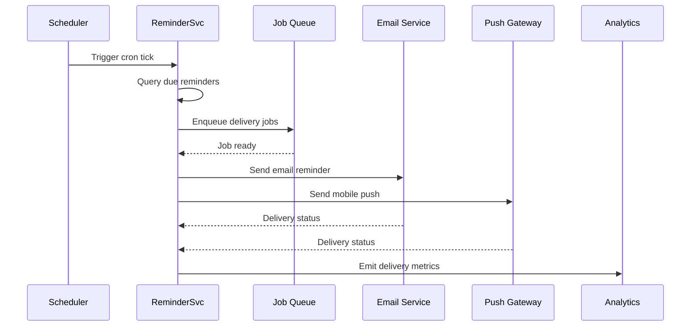
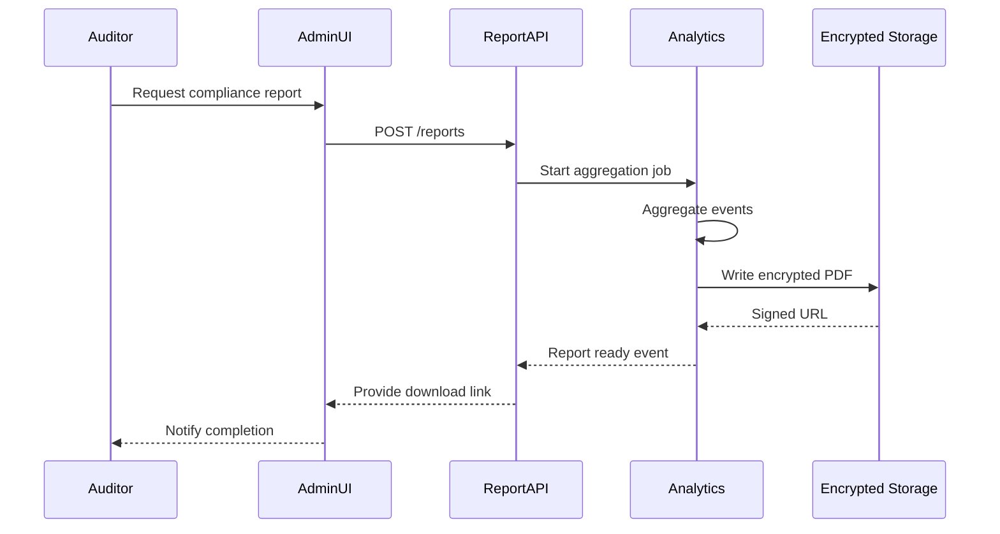

# シーケンス図 / Sequence Diagrams

## 認証ハンドシェイク / Authentication Handshake

```mermaid
sequenceDiagram
  participant User
  participant WebApp
  participant AuthGW as Auth Gateway
  participant OIDC as OIDC Provider
  participant TokenSvc as Token Service

  User->>WebApp: Submit credentials
  WebApp->>AuthGW: POST /login
  AuthGW->>OIDC: Redirect for authentication
  OIDC-->>User: Prompt MFA challenge
  User->>OIDC: Complete WebAuthn
  OIDC-->>AuthGW: ID Token + Access Token
  AuthGW->>TokenSvc: Exchange for session token
  TokenSvc-->>AuthGW: Session + Refresh tokens
  AuthGW-->>WebApp: Set secure cookie + headers
  WebApp-->>User: Authenticated session established
```

## 共同編集セッション / Collaborative Editing Session

```mermaid
sequenceDiagram
  participant Alice
  participant Bob
  participant WebSocket as Realtime Gateway
  participant TaskSvc as Task Service
  participant EventBus

  Alice->>WebSocket: Update task description
  WebSocket->>TaskSvc: Apply patch
  TaskSvc->>TaskSvc: Validate optimistic lock
  TaskSvc->>EventBus: Publish task.updated
  EventBus-->>WebSocket: Broadcast diff
  WebSocket-->>Alice: ACK + merged state
  WebSocket-->>Bob: Push diff
  Bob->>WebSocket: Confirm receipt
```

## リマインダー通知 / Reminder Notification

```mermaid
sequenceDiagram
  participant Scheduler
  participant ReminderSvc
  participant Queue as Job Queue
  participant Email as Email Service
  participant Push as Push Gateway

  Scheduler->>ReminderSvc: Trigger cron tick
  ReminderSvc->>ReminderSvc: Query due reminders
  ReminderSvc->>Queue: Enqueue delivery jobs
  Queue-->>ReminderSvc: Job ready
  ReminderSvc->>Email: Send email reminder
  ReminderSvc->>Push: Send mobile push
  Email-->>ReminderSvc: Delivery status
  Push-->>ReminderSvc: Delivery status
  ReminderSvc->>Analytics: Emit delivery metrics
```

## 監査レポート生成 / Audit Report Generation

```mermaid
sequenceDiagram
  participant Auditor
  participant AdminUI
  participant ReportAPI
  participant Analytics
  participant Storage as Encrypted Storage

  Auditor->>AdminUI: Request compliance report
  AdminUI->>ReportAPI: POST /reports
  ReportAPI->>Analytics: Start aggregation job
  Analytics->>Analytics: Aggregate events
  Analytics->>Storage: Write encrypted PDF
  Storage-->>Analytics: Signed URL
  Analytics-->>ReportAPI: Report ready event
  ReportAPI-->>AdminUI: Provide download link
  AdminUI-->>Auditor: Notify completion
```
