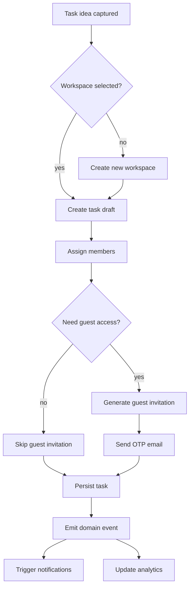
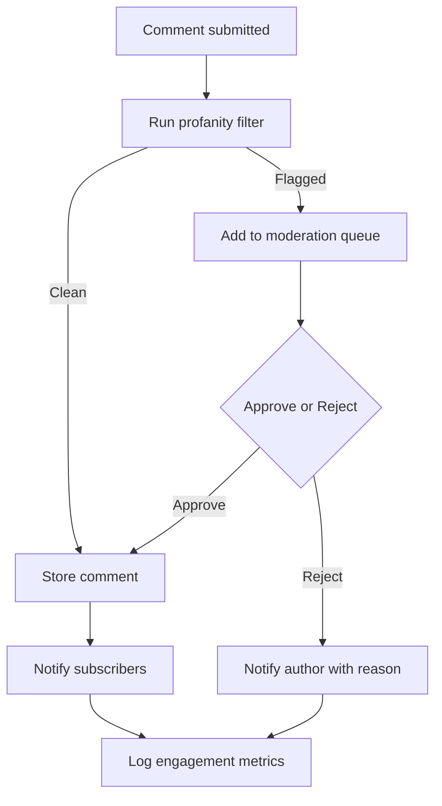
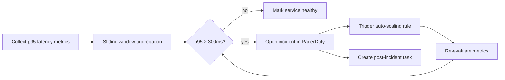

# 業務フロー / Workflows

## タスク作成と共有フロー / Task Creation & Sharing

## 認証とセッション管理フロー / Authentication & Session Management

```mermaid
flowchart LR
  Start((Start)) --> Detect[Detect login entrypoint]
  Detect -->|SSO| OIDC[Redirect to OIDC Provider]
  Detect -->|Email OTP| OTP[Send One-Time Password]
  OIDC --> Callback[Handle OIDC callback]
  OTP --> VerifyOTP[Verify OTP code]
  Callback --> TokenIssue[Issue access & refresh tokens]
  VerifyOTP --> TokenIssue
  TokenIssue --> MFA{MFA required?}
  MFA -- yes --> Challenge[Prompt WebAuthn challenge]
  Challenge --> TokenUpdate[Bind MFA claim]
  MFA -- no --> TokenUpdate
  TokenUpdate --> SessionStore[Persist session + device fingerprint]
  SessionStore --> PolicyEval[Evaluate RBAC & ABAC policies]
  PolicyEval --> IssueCookie[Set secure cookies / headers]
  IssueCookie --> End((Authenticated))
```

## コメントモデレーションフロー / Comment Moderation

## SLA違反検知フロー / SLA Breach Detection

各フローチャートはCI内のRAG検索テストで、特定のフローに関する質問（例: 「OTPログインの流れは？」）へ素早くリンクできるよう設計されています。
